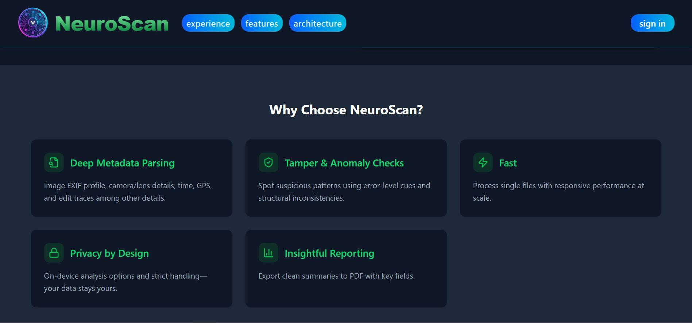

 <br>
# Metapeek
*Your window into the hidden data of every image.*

Metapeek is a cutting-edge **image forensics and metadata analysis platform** designed to help users extract, inspect, and visualize metadata from images and media files. It offers an intuitive interface for both technical and non-technical users to perform detailed image analysis, verify authenticity, and gain insights from embedded metadata.

---

## Features

- **Image Upload & Preview**: Easily upload images in various formats (JPEG, PNG, HEIC, etc.) and preview them in-app.  
- **Metadata Extraction**: Extract EXIF, IPTC, XMP, GPS, and other metadata from images using advanced parsing libraries.  
- **Interactive Metadata Viewer**: Display metadata in an organized and readable JSON format.  
- **Map Viewer**: Visualize GPS coordinates from image metadata on an interactive map.  
- **Data Privacy First**: All analysis runs locally in the browser; no data is sent to external servers.  
- **Light & Dark Mode**: Toggle between themes for optimal viewing.  
- **Responsive Design**: Works seamlessly on desktop, tablet, and mobile devices.  
- **Watermarking**: Customizable watermark overlay for branding purposes on reports (e.g., "Metapeek").  

---

## Screenshots




---

## Installation

### Prerequisites

- Node.js v18+  
- pnpm or npm package manager  

### Steps

1. Clone the repository:

```bash
git clone https://github.com/acunetix2/metapeek.git
cd metapeek

2. Install dependencies:

```bash
pnpm install
# or
npm install
```

3. Start the development server:

```bash
pnpm run dev
# or
npm run dev
```

4. Open [http://localhost:5173](http://localhost:5173) in your browser.

---

## Usage

1. Navigate to the **Upload Area** on the homepage.
2. Drag and drop an image or select one from your device.
3. View extracted metadata in the **Metadata Card** panel.
4. If GPS coordinates exist, open the **Map Viewer** to see the location.
5. Use the **Search** and **Filter** options to explore metadata efficiently.

---

## Contributing

We welcome contributions to improve Metapeek! To contribute:

1. Fork the repository.
2. Create a new branch: `git checkout -b feature/your-feature-name`.
3. Make your changes and commit: `git commit -m "Add your feature"`.
4. Push to your branch: `git push origin feature/your-feature-name`.
5. Open a Pull Request on GitHub.

---

## License

Metapeek is released under the **MIT License**. See [LICENSE](./LICENSE) for details.

---

## Contact

For support or inquiries, contact:

Email: [iddychesire098@gmail.com](mailto:iddychesire098@gmail.com)
Website: [https://meta-peek.vercel.app](https://meta-peek.vercel.app)

---

*Metapeek – Your window into the hidden data of every image.*

*Note: Still under development!*