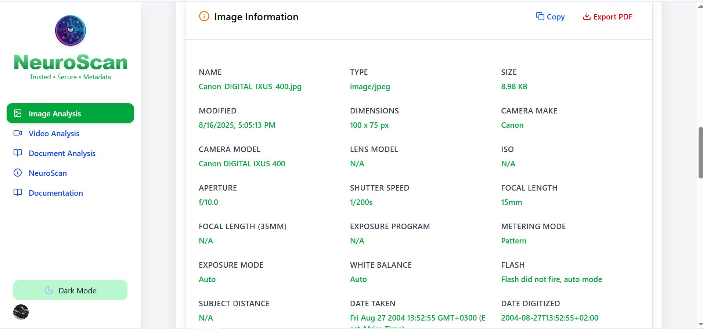

# Metapeek


Metapeek is a cutting-edge **image forensics and metadata analysis platform** designed to help users extract, inspect, and visualize metadata from images and media files. It offers an intuitive interface for both technical and non-technical users to perform detailed image analysis, verify authenticity, and gain insights from embedded metadata.

---

## Features

- **Image Upload & Preview**: Easily upload images in various formats (JPEG, PNG, HEIC, etc.) and preview them in-app.  
- **Metadata Extraction**: Extract EXIF, IPTC, XMP, GPS, and other metadata from images using advanced parsing libraries.  
- **Interactive Metadata Viewer**: Display metadata in an organized and readable JSON format.  
- **Map Viewer**: Visualize GPS coordinates from image metadata on an interactive map.  
- **Data Privacy First**: All analysis runs locally in the browser; no data is sent to external servers.  
- **Light & Dark Mode**: Toggle between themes for optimal viewing.  
- **Responsive Design**: Works seamlessly on desktop, tablet, and mobile devices.  
- **Watermarking**: Customizable watermark overlay for branding purposes (e.g., "Metapeek").  

---

## Screenshots




---

## Installation

### Prerequisites

- Node.js v18+  
- pnpm or npm package manager  

### Steps

1. Clone the repository:

```bash
git clone https://github.com/acunetix2/metapeek.git
cd metapeek
